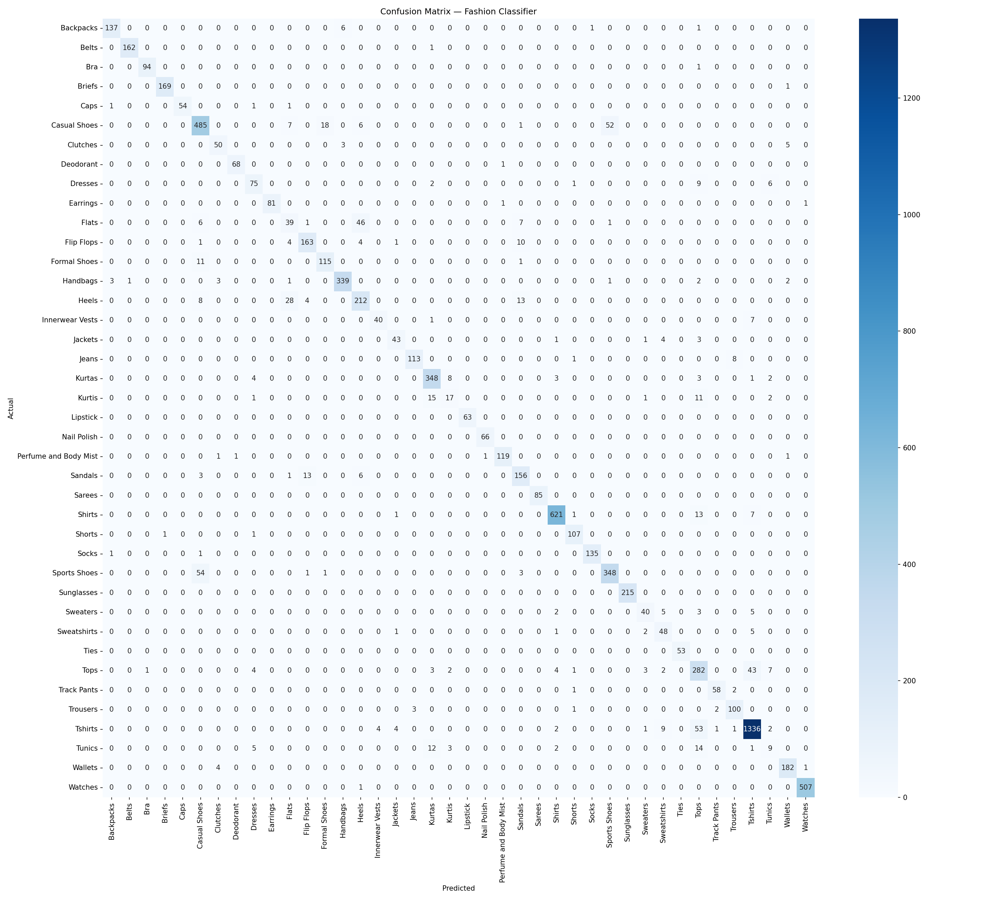

# StyleScan — AI Fashion Intelligence

## Live Demo
🚀 [Try StyleScan on HuggingFace Spaces](https://huggingface.co/spaces/RudraKsh-00/stylescan)

A deep learning web app that classifies fashion products and surfaces visually similar items using MobileNetV2 transfer learning.




## Results

| Metric | Value |
|--------|-------|
| Validation Accuracy | **91.5%** |
| Classes | 40 |
| Training Images | ~40,000 |
| Architecture | MobileNetV2 + Custom Head |
| Training Strategy | Transfer Learning → Fine-tuning |

## Project Structure

```
stylescan/
├── app.py                  # Flask backend
├── build_index.py          # One-time script to build similarity index
├── requirements.txt
├── models/
│   ├── fashion_classifier.keras   # Trained model (not in git)
│   ├── label_classes.npy          # Class names (not in git)
│   └── feature_index.npz          # Similarity index (not in git)
├── templates/
│   └── index.html          # Frontend
├── static/
│   └── uploads/            # Temp uploaded images
└── notebook/
    └── fashion_product_classifier.ipynb
```

## Setup

```bash
pip install -r requirements.txt
```

Place your trained model files in the `models/` directory:
- `fashion_classifier.keras`
- `label_classes.npy`

## Build Similarity Index (optional but recommended)

```bash
python build_index.py \
  --images_dir /path/to/fashion-dataset/images \
  --csv /path/to/styles.csv \
  --max_per_class 50
```

## Run

```bash
python app.py
```

Open `http://localhost:5000`

## Model Architecture

```
Input (224×224×3)
    └── MobileNetV2 (ImageNet pretrained, fine-tuned last 30 layers)
        └── GlobalAveragePooling2D
            └── Dense(256, relu)
                └── Dropout(0.3)
                    └── Dense(40, softmax)
```

## Training

- **Phase 1**: Frozen MobileNetV2 base, trained classification head — 89.5% val accuracy
- **Phase 2**: Unfroze last 30 layers, fine-tuned at LR=1e-5 — 91.5% val accuracy
- Dataset: [Fashion Product Images Dataset](https://www.kaggle.com/datasets/paramaggarwal/fashion-product-images-dataset)

## Tech Stack

- TensorFlow / Keras
- Flask
- NumPy, Pandas, scikit-learn
- Vanilla HTML/CSS/JS frontend
